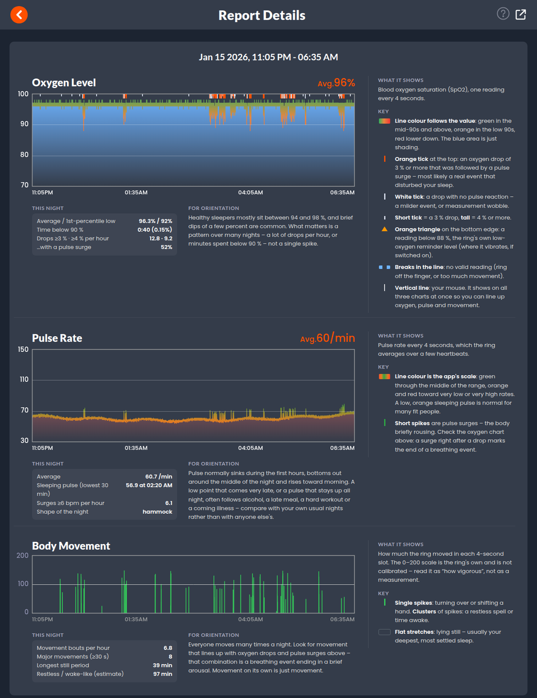
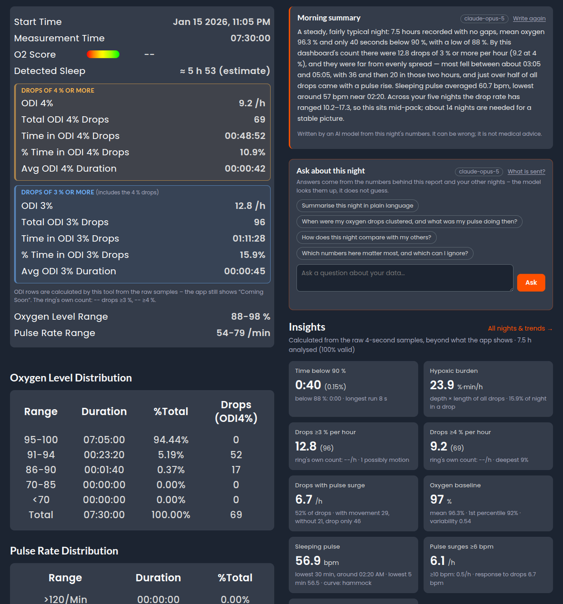
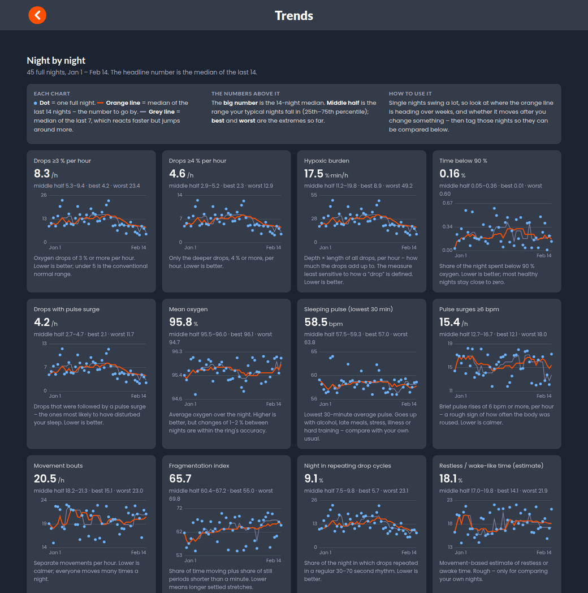
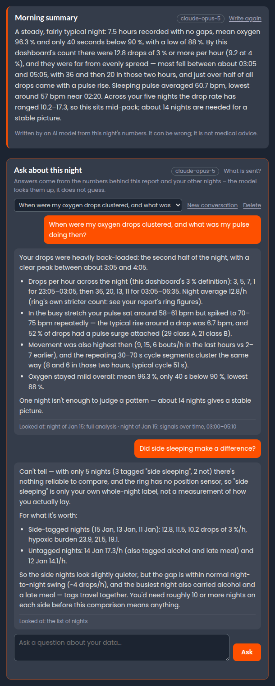
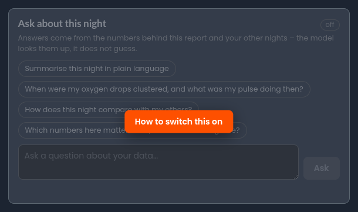
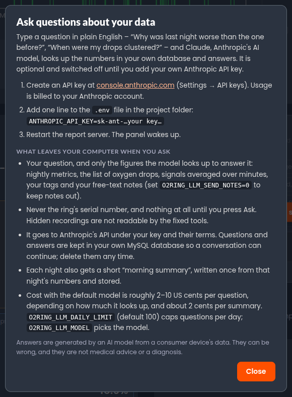
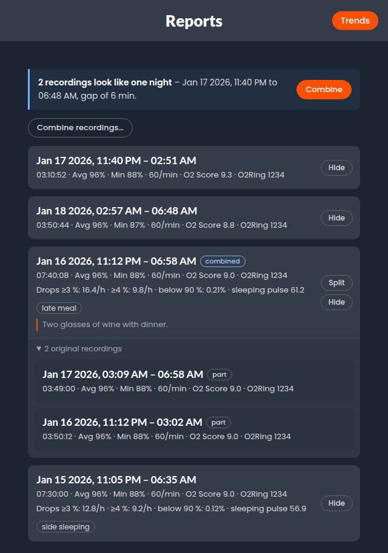
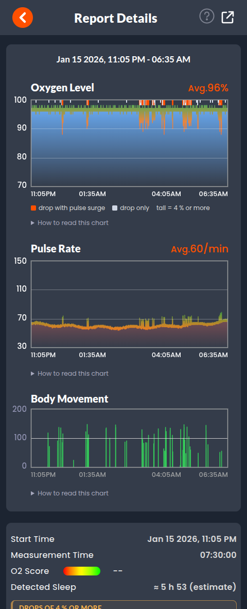

# lookee_o2ring_bluetooth

Download your overnight recordings from a **Lookee O2Ring** (Viatom / Wellue
O2Ring hardware) straight over Bluetooth LE – no phone app, no cloud – keep them
in your own MySQL database, and get reports that go well beyond what the app
shows.

- 📥 **Downloader** – talks the ring's BLE protocol directly (reverse-engineered,
  [documented here](docs/PROTOCOL.md)) and saves raw files, CSV and JSON
- 🗄️ **Your data, your database** – every 4-second sample, every detected oxygen
  drop, notes and tags in MySQL
- 📊 **Reports** – a faithful recreation of the app's *Report Details* screen,
  plus an **Insights** section built on [published research](docs/analytics-research.md)
- 📈 **Trends** – multi-night medians, personal baseline, tag comparisons
- 🧩 **Housekeeping** – combine a night the ring split into several files, hide
  test recordings
- 💬 **Ask** *(optional)* – put a question to your data in plain English; Claude
  looks the numbers up through read-only tools and the answer streams in. Each
  night also gets a one-paragraph **morning summary**. Off, and greyed out with
  instructions, until you add your own Anthropic API key

> **Not a medical device and not a diagnosis.** This is a personal wellness tool
> built on a consumer oximeter that is accurate to roughly ±2–3 % SpO2. It is not
> affiliated with or endorsed by Lookee, Viatom, Wellue or Lepu. If something in
> your data worries you, talk to a doctor.

**A night's report** – the app's charts, with a key and that night's numbers beside each one on a wide screen:



**Summary, morning summary, Ask and Insights** – the app's summary (with its ODI rows filled in) next to this project's own analysis:



**Trends** across nights, with the all-nights Ask panel on top:



**Ask** – questions in plain English, answered from your own database. Under each answer, what the model looked at:

| A conversation about one night | Until you add an API key |
|---|---|
|  | <br><br> |

| Sessions list – combine, split, hide, ask about all nights | The same report on a phone |
|---|---|
|  |  |

*All screenshots show synthetic data (`./o2ring_report.py --demo` plus made-up nights). The summary and the answers in
them are real model output – about those synthetic nights.*

## Quick start

Full instructions, including MySQL setup and troubleshooting, are in
**[INSTALL.md](INSTALL.md)**.

```bash
pip install -r requirements.txt

./o2ring_report.py --demo            # no ring needed: writes reports/demo.html from a synthetic night

./o2ring_download.py --list          # ring on your finger, phone app closed: show device info + files
./o2ring_download.py                 # download everything to ./o2ring_data (.dat, .csv, .json)
./o2ring_report.py --from-files o2ring_data   # static HTML reports, no database needed

cp .env.example .env                 # then, with MySQL configured:
./o2ring_download.py --db            # download + store + analyse in one go
cd server && npm install && npm start     # http://127.0.0.1:3000
```

## How it works

```
 O2Ring ──BLE──▶ o2ring_download.py ──▶ o2ring_data/*.dat  (raw file as stored on the ring)
                        │                        *.csv  (time, spo2, pr, motion, flags every 4 s)
                        │ --db                   *.json (the ring's own summary)
                        ▼
                  o2ring_db.py ──▶ MySQL: devices · sessions · samples
                        │
                        ▼
              o2ring_analytics.py ──▶ MySQL: session_metrics · desat_events
                                                     │
        o2ring_report.py ──▶ reports/*.html  ◀───────┤      (static, self-contained pages)
        server/ (Node.js) ──▶ http://127.0.0.1:3000 ◀┘      (live reports, notes, tags, trends, combine/hide)
                 │
                 └─ optional ──▶ Anthropic API               (Ask panel + morning summaries; only with your key,
                                                              only what the read-only tools return for a question)
```

### 1. Talking to the ring

The ring exposes one GATT service with a write and a notify characteristic, no
pairing and no encryption (as used by the Lookee app). Requests are
`AA cmd ~cmd block len payload crc8`; replies start with `55` and may span
several notifications. `INFO` returns a JSON blob that includes the file list;
each file is fetched with `READ_START` → `READ_CONTENT` × n → `READ_END`. A file
is a 40-byte summary header followed by 5-byte samples (SpO2, pulse, motion,
flags), one every 4 seconds.

Details, opcodes, the file layout and two firmware quirks (the ring answers
"OK" for a file it cannot open and re-sends the previous one; one night can
arrive as several files) are in **[docs/PROTOCOL.md](docs/PROTOCOL.md)**.

### 2. Storing it

| Table | Contents |
|---|---|
| `devices` | one row per ring: model, firmware, battery, last `INFO` JSON |
| `sessions` | one row per recording: the ring's summary, the raw file, notes, hidden / combined flags |
| `samples` | one row per 4 seconds; `NULL` where the ring had no valid reading |
| `session_metrics` | headline analytics per night as columns, everything else as JSON |
| `desat_events` | every oxygen drop: start / nadir / end, depth, length, area, pulse rise, movement, class |
| `tags`, `session_tags` | what was different that night |
| `ask_conversations`, `ask_messages`, `night_summaries` | your questions, the answers (with what was looked at) and the morning summaries – only if you use Ask |

Tables are created and migrated automatically. Re-running any import is safe:
sessions are unique per ring + file name.

### 3. Analysing it

`o2ring_analytics.py` is dependency-free Python over the 4-second samples.
What it computes – and, just as importantly, what it deliberately does *not* –
comes from a literature review written up in
**[docs/analytics-research.md](docs/analytics-research.md)**:

- **Time below 90 / 88 %**, longest run – the most robust oximetry metric
- **Oxygen drops (ODI 3 % / 4 %)** with a fixed, versioned, printed definition.
  Counts depend enormously on the definition (one real night ranged from 13 to
  222 "drops ≥3 %"), so the ring's own count is always shown alongside
- **Approximate hypoxic burden** – depth × length of all drops per hour
- **Drops with a pulse surge** – separates real events from measurement noise
- **Sleeping pulse** (lowest 30-minute mean), pulse surges, fast/slow episodes
- **Movement bouts and fragmentation**, a movement-only **sleep-window estimate**
- **Repeating drop cycles** – 30–70 s rhythm found by Fourier analysis
- The app's ten **ODI rows** and per-range **Drops (ODI4%)** column, which the
  app itself currently shows as "Coming Soon"

Not computed, because 4-second averaged data cannot support it: HRV, sleep
stages, AF detection, an "AHI estimate".

### 4. Showing it

- **Static pages** (`o2ring_report.py`): one self-contained HTML file per night –
  inline data, canvas charts, no server. Notes stay in the browser.
- **Report server** (`server/`, Express + mysql2): the same pages live from
  MySQL, plus
  - notes and tags saved to the database
  - **Trends**: every full night with rolling 7/14-night medians, share of nights
    above 5/15/30 drops per hour, tag with/without comparisons
  - **personal baseline** chips on each metric ("typical for you" / "higher than
    your usual") after 14 nights; "worth mentioning to a doctor" prompts only
    ever come from a week or more of data, never one night
  - **combine** recordings into one night (gaps stay visible and nothing is
    analysed across them), **split** them again, **hide** recordings

The report layout, colours and the app-side maths follow the app so that the
numbers match it exactly; all wording, and the Insights, are this project's own.

### 5. Asking questions (optional)

Everything above runs entirely on your machine. The **Ask** panel – on the
start page and the Trends page for questions about all your nights, and on each
report for questions about that night – is the one exception, and it stays greyed out – with a popup
explaining how to enable it – until `ANTHROPIC_API_KEY` is set in `.env`.

- **Morning summary.** Each night also gets one short paragraph at the top of
  its report – written once from that night's numbers, stored in MySQL
  (`night_summaries`), rewritten only if the analysis behind it changes or you
  press *Write again*. The downloader nudges a running server so it is ready
  before you open the report.
- **How it answers.** Answers stream in as they are written. The model never sees
  a data dump. It gets five read-only tools (`server/ask-tools.js`): list nights, one night's full analysis, the
  individual oxygen drops, the signals averaged over minutes, and the multi-night
  trends with tag comparisons. Each is a bounded `SELECT`; none can write; hidden
  recordings and the ring's serial number are out of reach. Under every answer a
  "Looked at" line lists what it actually fetched.
- **How it is told to reason.** The system prompt (`server/ask.js`) carries this
  project's definitions and the ground rules from the
  [research notes](docs/analytics-research.md): numbers only from tool results,
  one night means little, drop counts depend on the definition, ±2–3 % ring
  accuracy, no diagnosis, and "talk to a doctor" for persistent patterns or
  symptoms. Notes and tags are treated as data, never as instructions.
- **What is sent.** Your question plus whatever the tools returned for it –
  nightly metrics, drops, averaged signals, tags and (unless
  `O2RING_LLM_SEND_NOTES=0`) your notes – to Anthropic's API under your key.
  Nothing is sent until you press Ask.
- **What is kept.** Questions and answers are stored in your own MySQL
  (`ask_conversations`, `ask_messages`) so a conversation can be continued or
  deleted from the panel.
- **Optional SQL tool** (`O2RING_LLM_SQL=1`, `server/ask-sql.js`). For questions
  the fixed tools cannot answer, the model may write its own `SELECT`. It runs
  through a *separate MySQL user that can only read* – the server inspects that
  user's grants at start-up and keeps the tool off if it finds anything beyond
  `SELECT` – and each statement is also checked (single `SELECT`/`WITH`, no
  file or system functions, no system schemas), run in a read-only transaction
  with a 3-second limit, and cut off at 200 rows. Column-level grants keep the
  ring's serial number and the raw files unreadable. Setup is in INSTALL.md.
- **Is it any good?** `evals/ask/` holds 32 test questions – look-ups,
  comparisons, things the ring cannot measure, safety, privacy, a follow-up –
  that are asked through the running server and graded against facts pulled
  fresh from your own database. Run them after changing the prompt, the tools
  or the model: see **[evals/ask/README.md](evals/ask/README.md)**.
- **Cost and limits.** Default model `claude-opus-5` (`O2RING_LLM_MODEL` to
  change). Measured on real nights: about 2–10 US cents per question depending on
  how much it looks up, and about 2 cents per morning summary; follow-ups are
  cheaper thanks to prompt caching. At most 8 look-up rounds per question and
  `O2RING_LLM_DAILY_LIMIT` (default 100) questions a day.

Answers come from an AI model reading a consumer device's data. They can be
wrong and they are not medical advice.

## Command reference

| Command | |
|---|---|
| `./o2ring_download.py [--list] [--db] [--address MAC] [--out DIR] [--force] [--no-sync-time]` | talk to the ring |
| `./o2ring_db.py [DIR]` | import already-downloaded `.dat` files |
| `./o2ring_db.py --reanalyze [--force]` | (re)compute analytics, e.g. after changing a definition |
| `./o2ring_report.py [--session NAME] [--from-files DIR] [--demo] [--out DIR]` | static HTML reports |
| `footer.html` | the footer every page gets (logo + links) – one place to edit |
| `ask_panel.html` | the Ask panel and morning-summary card, shared by the start page, reports and Trends |
| `cd server && npm start` | report server on `127.0.0.1:3000` (`HOST`, `PORT` to change) |
| `python3 -m unittest discover -s tests` · `cd server && npm test` | tests |

Server API: `GET /api/sessions[?all=1]`, `GET /api/sessions/:id`,
`PUT /api/sessions/:id/notes`, `PUT /api/sessions/:id/tags`,
`PUT /api/sessions/:id/hidden`, `POST /api/sessions/combine`,
`POST /api/sessions/:id/split`, `GET /api/tags`, `GET /api/trends`,
`GET /api/ask/status`, `POST /api/ask` and `POST /api/ask/stream` (server-sent events)
with `{question, session_id?, conversation_id?}`, `GET`/`POST /api/sessions/:id/summary`,
`GET /api/ask/conversations[?session_id=]`, `DELETE /api/ask/conversations/:id`.

## Privacy and security

- Recordings are health data. `o2ring_data/`, `reports/` and `.env` are
  git-ignored – keep it that way.
- Nothing leaves your machine unless you switch on the optional Ask panel with
  your own Anthropic API key (see *Asking questions* above for exactly what it
  sends). The key lives only in `.env` and is never sent to the browser.
- The server has **no login** and binds to `127.0.0.1`. Only expose it on a
  network you trust, or put it behind a reverse proxy with authentication.
- Even on localhost a web page you visit could try to reach it, so the server
  only answers requests addressed to a known host name (blocks DNS rebinding;
  add names with `O2RING_ALLOWED_HOSTS`), accepts changes only as JSON from its
  own origin (blocks cross-site requests), sends a strict Content-Security-Policy
  and escapes everything that came from the ring or from you. All SQL is
  parameterised. File names reported by the ring are validated before they are
  used as paths.
- No credentials live in the code: database settings come from the environment
  or `.env`.
- By default the downloader sets the ring's clock, as the app does on every
  connection (`--no-sync-time` to skip). Nothing else on the ring is changed and
  nothing is deleted from it.

## Compatibility

Developed against a Lookee O2Ring (model 1652, firmware 1.13.0, file version 3)
on Linux with BlueZ. The same protocol family is used by other Viatom / Wellue
rings (O2Ring, SleepU, Oxylink, …); they are likely to work but are untested
(the vendor SDK treats the newer "O2Ring S" as a separate model, so it may differ).
Reports welcome.

## Acknowledgements

Protocol knowledge comes from reading the vendor's Android app; no vendor code
is included here. The analytics lean on published work by Azarbarzin, Blanchard,
Levy & Behar, Chung, Punjabi, Lechat and others – see the
[research notes](docs/analytics-research.md) for references.

## License and contributing

Released into the public domain under **[The Unlicense](LICENSE)**: use it, change
it, ship it, sell it – no conditions, no attribution needed, and no warranty.

- Contributions are welcome. By opening a pull request you agree that your
  contribution is released under the same public-domain dedication.
- The NorthTrail.ai name and logo identify the project's origin and are not part
  of the public-domain dedication. If you publish a fork, please swap them for
  your own in `footer.html` and `assets/`.
- Lookee, Viatom, Wellue and O2Ring are names of their respective owners, used
  here only to say which hardware this works with.

---

<p align="center">
  <a href="https://northtrail.ai/"></a><br>
  An open-source project by <a href="https://northtrail.ai/">NorthTrail.ai</a>
</p>
